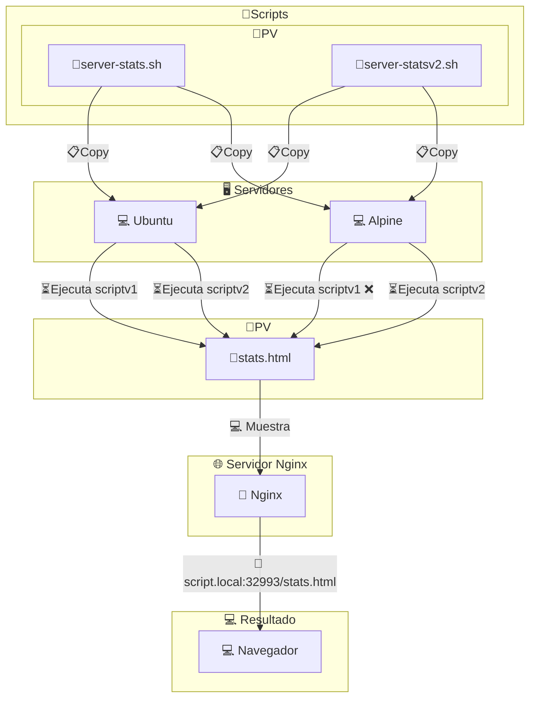
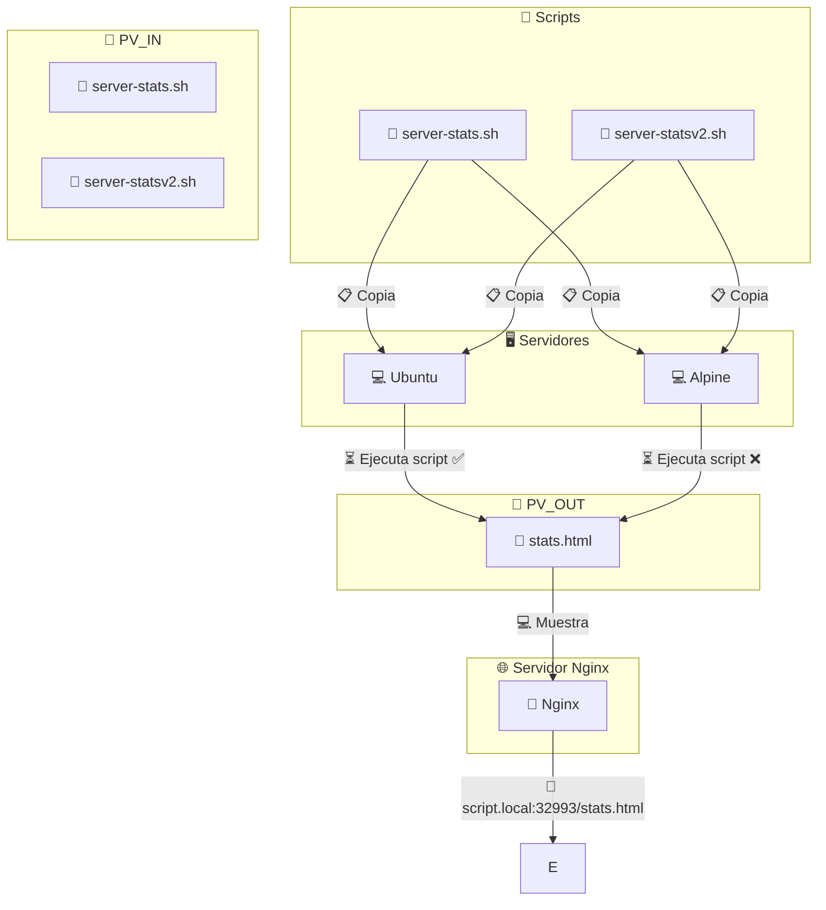

# Organización idea de probarlo en Terraform

```mermaid
graph TD;
    subgraph Servidor["🖥️ Servidores"]
        S1["💻 Ubuntu"];
        S2["💻 Alpine"];
    end

    subgraph Scripts["📝Scripts"]
        subgraph Persist_volumen_IN["📂PV"]
            F1["📄server-stats.sh "];
            F2["📄server-statsv2.sh "];
        end
    end
        subgraph Persist_volumen_out["📂PV"]
        O["📄stats.html "];
    end

    subgraph Nginx_Server["🌐 Servidor Nginx"]
        N["🚀 Nginx"];
    end

     subgraph Navegador["💻  Resultado"]
        E["💻 Navegador"];
    end;

    F1 -->|📋Copy| S1 
    S1 -->|⏳Ejecuta scriptv1| O

    F1 -->|📋Copy| S2 
    S2 -->|⏳Ejecuta scriptv1 ❌| O

    F2 -->|📋Copy| S1 
    S1 -->|⏳Ejecuta scriptv2| O
    

    F2 -->|📋Copy| S2 
    S2 -->|⏳Ejecuta scriptv2| O
    


    O -->|💻 Muestra| N
    N -->|🔗 script.local:32993/stats.html|E


```

La idea principal es ejecutar el script en Ubuntu y Alpine con la versión 1 no funciona en BusyBox por eso se crea la versión 2 mejorada

```mermaid
graph TD;
    subgraph Servidor["🖥️ Servidores"]
        S1["💻 Ubuntu"];
        S2["💻 Alpine"];
    end

    subgraph Scripts["📝 Scripts"]
        F1["📄 server-stats.sh"];
        F2["📄 server-statsv2.sh"];
    end

    subgraph Persist_volumen_IN["📂 PV_IN"]
        I1["📄 server-stats.sh"];
        I2["📄 server-statsv2.sh"];
    end

    subgraph Persist_volumen_OUT["📂 PV_OUT"]
        O["📄 stats.html"];
    end

    subgraph Nginx_Server["🌐 Servidor Nginx"]
        N["🚀 Nginx"];
    end

    
   

    %% Copia los scripts a los servidores
    F1 -->|📋 Copia| S1 
    F1 -->|📋 Copia| S2 
    F2 -->|📋 Copia| S1 
    F2 -->|📋 Copia| S2 

    %% Ejecución de scripts en servidores
    S1 -->|⏳ Ejecuta script ✅| O
    S2 -->|⏳ Ejecuta script ❌| O

    %% Nginx muestra la página
    O -->|💻 Muestra| N
    N -->|🔗 script.local:32993/stats.html|E

```